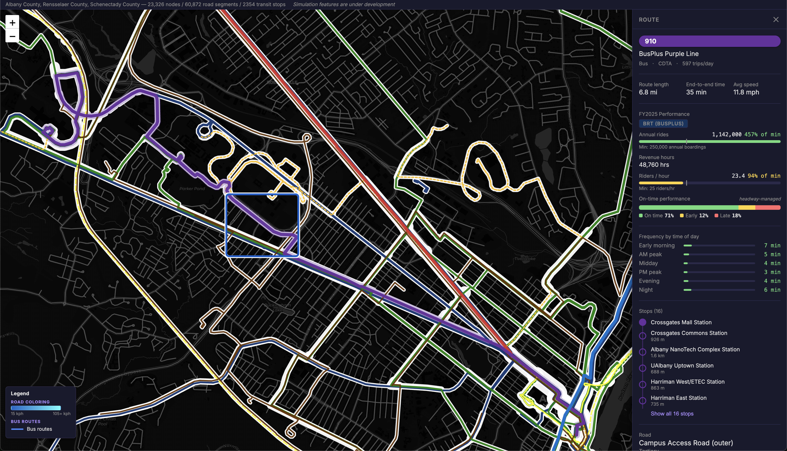

# Albany Transit & Road Map

An interactive map of Albany's transit and road network.

Built around real Albany County, NY data — OpenStreetMap road network, CDTA bus GTFS feeds, Amtrak rail shapes.



## What it does

- Loads the Albany County road graph from OSM (~30–60s cached after first run).
- Pulls GTFS feeds for CDTA buses and Amtrak; snaps stops and route shapes to OSM edges.
- Renders the network on an interactive map with CDTA division filtering.

## Stack

- **Backend:** Python 3.12, FastAPI, osmnx, NetworkX, pandas. In-process state (no DB).
- **Frontend:** React 18, TypeScript, Vite, Zustand, Leaflet.
- **Data:** OpenStreetMap (via osmnx), CDTA GTFS, Amtrak GTFS, Overpass API for bike infrastructure.

## Status

MVP — locally runnable end-to-end. All 8 backend unit tests pass. Frontend production build is clean.

Known limitations:

- No persistence — state lives in memory and resets on server restart.
- Edge geometry renders as straight u→v lines rather than curved OSM road shapes.

See `BACKLOG.md` for the full post-MVP list.

## Running locally

**Backend** (port 8000):

```bash
cd backend
/opt/homebrew/bin/python3.12 -m venv venv
source venv/bin/activate
pip install -r requirements.txt
uvicorn main:app --reload --port 8000
```

Python 3.12 specifically — 3.14 lacks wheels for osmnx/numpy.

**Frontend** (port 3000, proxies `/api` → backend):

```bash
cd frontend
npm install
npm run dev
```

Open <http://localhost:3000>.

## Repository layout

```text
├── backend/      FastAPI server
├── frontend/     React/TypeScript SPA
├── MVP.md        Locked MVP feature list
└── BACKLOG.md    Post-MVP enhancements
```
